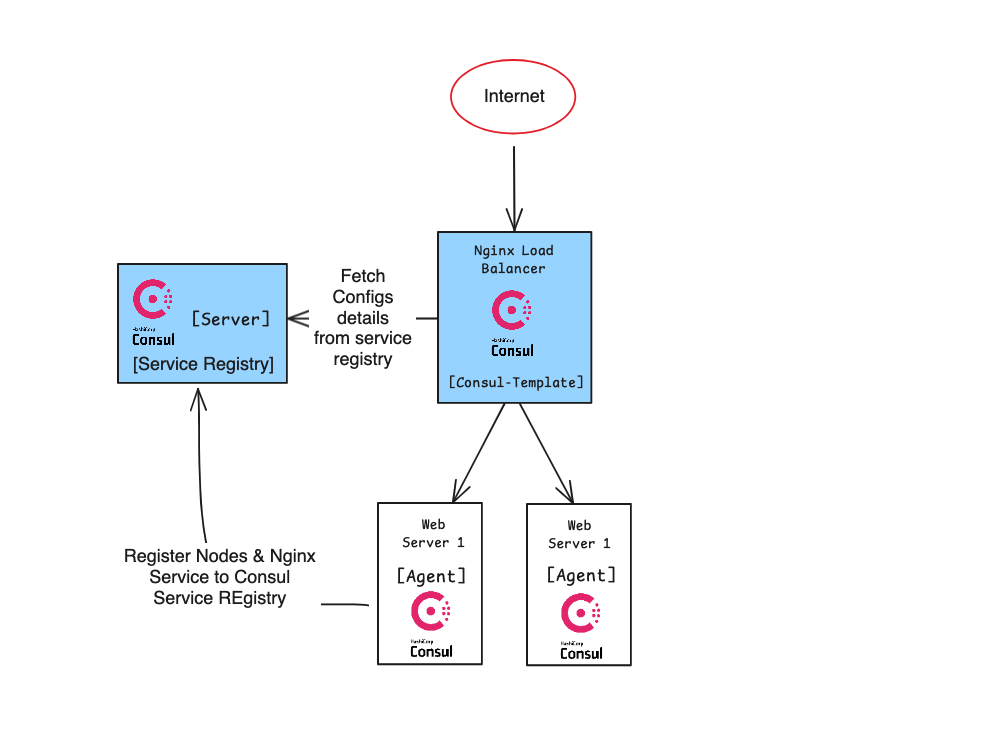

# Vagrant Setup for Service Discovery

This repository contains a Vagrant configuration to create and provision machines for demonstrating service discovery. The setup is based on the example provided by [DevOpsCube]([https://devopscube.com/service-discovery-explained/)

## Architecture 



## Prerequisites

- [Vagrant](https://www.vagrantup.com/) installed
- [VirtualBox](https://www.virtualbox.org/) installed


# Getting Stared

1. Clone the Repository

```
git clone git@github.com:raaha/devops-projects.git
cd consul-service-discovery/vagrant/
```

2. Start the Vagrant Environment

```
vagrant up --provision
```

3. Access the Consul server

The settings provides local access via http://localhost:8500 

4. Access the Machines

To access any of the machines, use the `vagrant ssh` command followed by the machine name. For example:

```
vagrant ssh <machine-name>
```

# Vagrantfile Overview

The Vagrantfile in this repository defines the configuration for multiple virtual machines, each configured for specific roles in the service discovery setup. It provisions the machines with the necessary software and configuration to demonstrate service discovery concepts.

# Acknowledgments

- Based on the example by [DevOpsCube.](https://devopscube.com/service-discovery-explained/)
